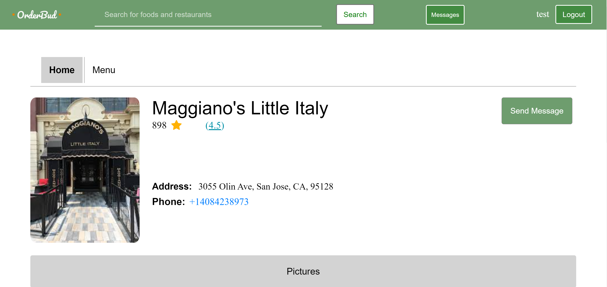
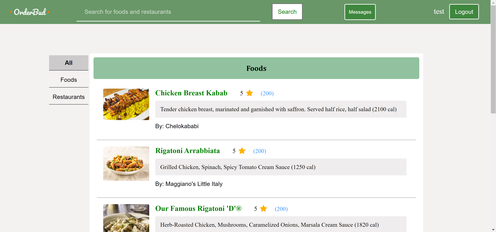
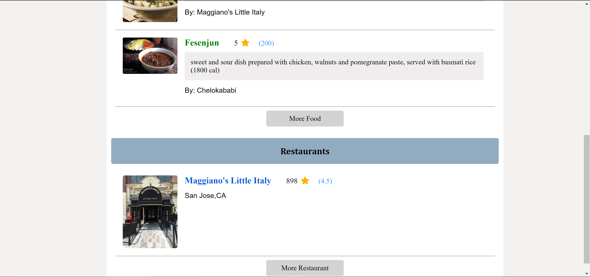

# **OrderBud Web Application**
link to repository: https://github.com/aryankhadiri/orderBud
## **Description**
OrderBud is an online menu platform that allows restaurants to create their menus and provide other usefull information about their businesses. Users on the other hand, can perform several different tasks such as searching for a restaurant or a menu item, leaving reviews, messaging the restaurant and more.

**Note:** as of now, only the user side of the application is implemeneted and restaraunts are yet to be enabled to create accounts

**Features Implemented**:
* User can search for restaurants and foods
* User can send a direct message to the restaurant
* User can review foods and restaurants seperatley
* User can create accounts
* User can login and logout
* User can check their messages and comminucate with the restaurants
* Restaurant Home Pages are designed and completed
* Food Home pages are designed and completed
* Restaurant menus are available in their page
* User can filter search results

## **Steps to install the application**
1. Install latest version of python (3 above)
2. Download Elasticsearch from elasticsearch website and keep it running inside a terminal or a cmd window. Check for the port and make sure it is 9200
3. Locate the file "requirements.txt" in the home directory and install all the required packages via:
```bash
pip install <packagename>
```
4. Open terminal and navigate to the homedirectory where the manage.py file is located
5. Run the following command:
```bash
python3 manage.py runserver 
```
6. locate the response link and click on it to open the browser

**Note:** The database is not on github. So in order to add information to the database you also need to install Kibana on your system and follow the elasticsearch tutorial to insert information into the database. The test data is inside the data.json which is in the home directory

## **High Level description of the system**
* Backend: Backend is running by Django and Python which is the most important component of the system. 
* Database: There are two databases in our system One is the Elasticsearch which includes all the data that are meant to be searchable. The other database is the Django database which is a sqlite database and as of now only stores the user informatoin for authentication purposes
* Front-end: Front end is mainly the HTML, CSS and javaScript. We also extensivley use jQuery in our javaScript for simple and fast implementation.

## **Future Work** 
There are more to our project that it currently include. We have ideas and features that we belive set our applicationo seperate from currently available review based applications and make it a great choice for restaurant owners and customers. Some of the future work we have in mind include but are not limited to:
* Adding Nutrition Facts for the foods
* Allowing users to filter the items of the menus based on category
* Adding business hours fo the restaurants
* Adding the amenities of the restaurants
* Including an algorithm to exclude useless reviews
* Imlement the restaurant side to allow them add their accounts and information 

## **Sample Screen Shots**
Maggiano's littel Italy Home Page



Searching for Chicken Food in San Jose


